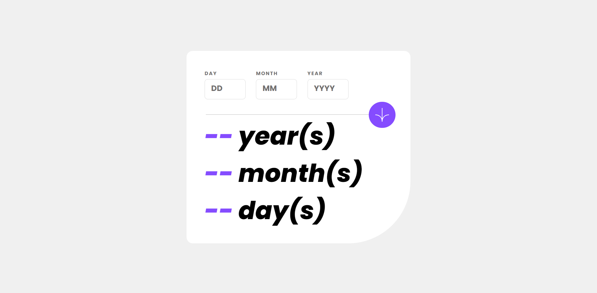

# Frontend Mentor - Age calculator app solution

This is a solution to the [Age calculator app challenge on Frontend Mentor](https://www.frontendmentor.io/challenges/age-calculator-app-dF9DFFpj-Q). Frontend Mentor challenges help you improve your coding skills by building realistic projects. 

## Table of contents

- [Overview](#overview)
  - [The challenge](#the-challenge)
  - [Screenshot](#screenshot)
- [My process](#my-process)
  - [Built with](#built-with)
  - [What I learned](#what-i-learned)
  - [Useful resources](#useful-resourses)

## Overview

### The challenge

Users should be able to:

- View an age in years, months, and days after submitting a valid date through the form
- Receive validation errors if:
  - Any field is empty when the form is submitted
  - The day number is not between 1-31
  - The month number is not between 1-12
  - The year is in the future
  - The date is invalid e.g. 31/04/1991 (there are 30 days in April)
- View the optimal layout for the interface depending on their device's screen size
- See hover and focus states for all interactive elements on the page
- **Bonus**: See the age numbers animate to their final number when the form is submitted

### Screenshot



## My process

### Built with

- HTML
- CSS
- JS

### What I learned

In this project, I learned how to use regex patterns to validate date input and calculate and display an individual's age using JS DOM manipulation.

```js
const regexDays = /^(0[1-9]|[12][0-9]|3[01])$/;
const regexMonths = /^(0[1-9]|1[0-2])$/;
const regexYears = /^(19|20)\d{2}$/;
```

### Useful resources

- [freeCodeCamp.org](https://www.freecodecamp.org/news/regex-for-date-formats-what-is-the-regular-expression-for-matching-dates/#howtomatchdateswithregularexpressionsexample2) - This provided me with the regex patterns for dd, mm, and yyyy date format. I really liked this pattern and will use it going forward.
